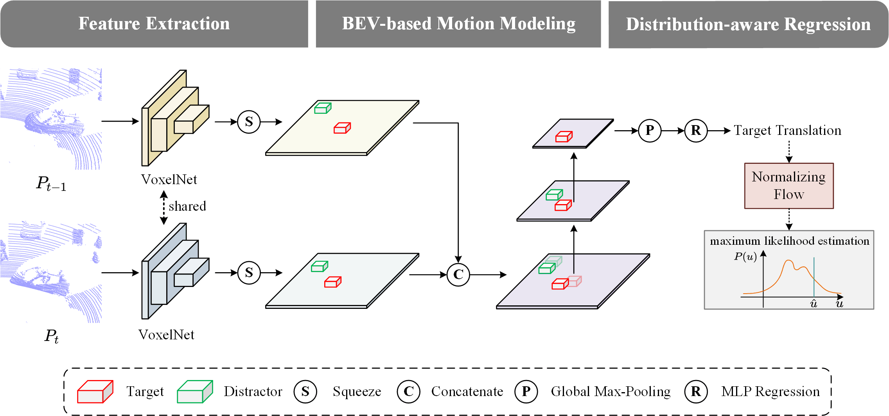
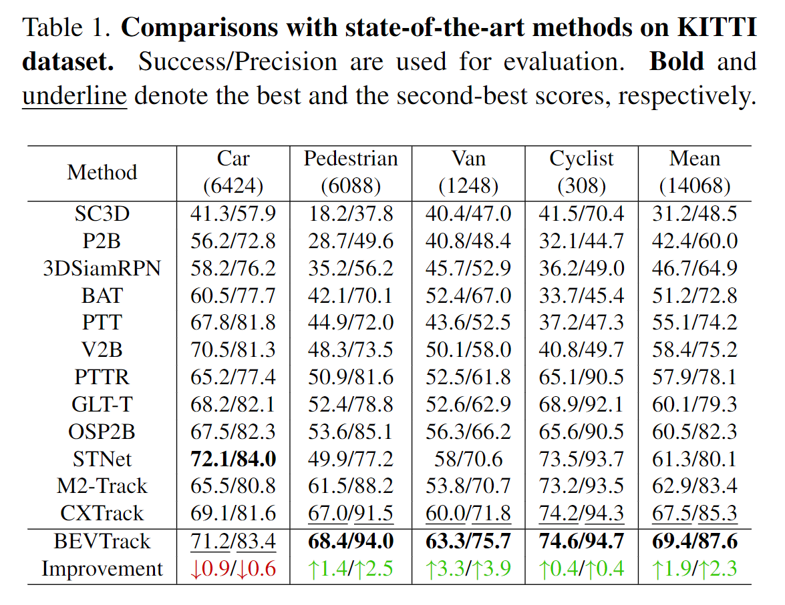
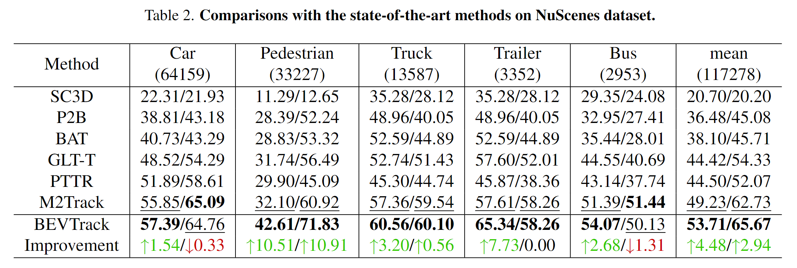

<h1 align="center">BEVTrack: A Simple Baseline for Point Cloud Tracking in Bird’s-Eye-View</h1>
<p align="center">
<a href="https://arxiv.org/abs/">.svg" ></a>
<h5 align="center"><em>Yuxiang Yang, Yingqi Deng, Jiahao Nie, Jing Zhang</em></h5>
<p align="center">
  <a href="#introduction">Introduction</a> |
  <a href="#results">Results</a> |
  <a href="#relevant projects">Relevant Projects</a>
</p>
<figure>
<p align="center">
 
</figure>

## Introduction
<p align="justify">3D single object tracking (SOT) in point clouds is still a challenging problem due to appearance variation, distractors, and high sparsity of point clouds. Notably, in autonomous driving scenarios, the target object typically maintains spatial adjacency across consecutive frames, predominantly moving horizontally. This spatial continuity offers valuable prior knowledge for target localization. However, existing trackers, which often employ point-wise representations, struggle to efficiently utilize this knowledge owing to the irregular format of such representations. Consequently, they require elaborate designs and solving multiple subtasks to establish spatial correspondence. In this paper, we introduce BEVTrack, a simple yet strong baseline framework for 3D SOT. After converting consecutive point clouds into the common Bird's-Eye-View representation, BEVTrack inherently encodes spatial proximity and adeptly captures motion cues for tracking via a simple element-wise operation and convolutional layers. Additionally, to better deal with objects having diverse sizes and moving patterns, BEVTrack directly learns the underlying motion distribution rather than making a fixed Laplacian or Gaussian assumption as in previous works. Without bells and whistles, BEVTrack achieves state-of-the-art performance on KITTI and NuScenes datasets while maintaining a high inference speed of 122 FPS. 

## Results
### Comparison with State-of-the-art Methods
<figure>
<p align="center">
 
</figure>

<figure>
<p align="center">
 
</figure>

## Statement

<p align="justify">If you are interested in our work, please consider citing the following:</p>

```
@article{}
```
<p align="justify">This project is under MIT licence.</p>

## Relevant Projects

[1] <strong>GLT-T: Global-Local Transformer Voting for 3D Single Object Tracking in Point Clouds, AAAI, 2023</strong> | [Paper](https://arxiv.org/abs/2211.10927) | [Github](https://github.com/haooozi/GLT-T) <br><em>&ensp; &ensp; &ensp;Jiahao Nie<sup>&#8727;</sup>, Zhiwei He<sup>&#8727;</sup>, Yuxiang Yang, Mingyu Gao, Jing Zhang</em>
